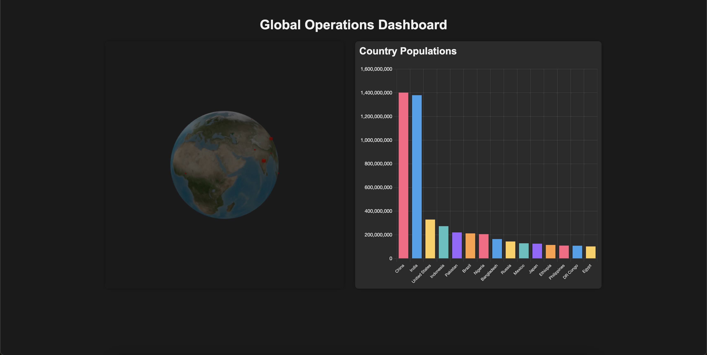

# 3D Global Operations Dashboard

## Overview
This project is a 3D Global Operations Dashboard that visualizes global population data using Three.js for 3D rendering and Chart.js for 2D charts. It fetches real-time data from the REST Countries API to display population information for the top 15 most populous countries.

## Screenshot


## Features
- Interactive 3D globe visualization using Three.js
- Population data represented by scaled 3D cubes on the globe
- Bar chart showing population data for top 15 countries
- Real-time data fetching from REST Countries API
- Responsive design that adjusts to window resizing
- Dark mode UI for improved visibility

## Technologies Used
- Vite.js for project scaffolding and bundling
- Three.js for 3D rendering
- Chart.js for 2D chart visualization
- Vanilla JavaScript for logic and DOM manipulation
- REST Countries API for country data

## Setup and Installation
1. Clone the repository:
   ```
   git clone https://github.com/your-username/global-ops-dashboard.git
   cd global-ops-dashboard
   ```

2. Install dependencies:
   ```
   npm install
   ```

3. Run the development server:
   ```
   npm run dev
   ```

4. Open your browser and navigate to `http://localhost:5173` (or the port specified by Vite)

## Usage
- The 3D globe can be rotated and zoomed using mouse controls
- Hover over the cubes on the globe to see country names (if implemented)
- The bar chart provides a 2D visualization of the population data

## Customization
- To change the number of countries displayed, modify the `slice(0, 15)` line in the API data processing
- Adjust cube colors by modifying the `cubeMaterial` in the `initScene` function
- Modify chart colors by changing the `backgroundColor` array in the `createChart` function

## API Reference
This project uses the [REST Countries API](https://restcountries.com/). No API key is required for basic usage.

## Contributing
Contributions, issues, and feature requests are welcome. Feel free to check [issues page](https://github.com/your-username/global-ops-dashboard/issues) if you want to contribute.

## License
This project is licensed under the MIT License - see the [LICENSE.md](LICENSE.md) file for details.

## Acknowledgments
- Three.js community for documentation and examples
- Chart.js for easy-to-implement charts
- REST Countries API for providing free access to country data